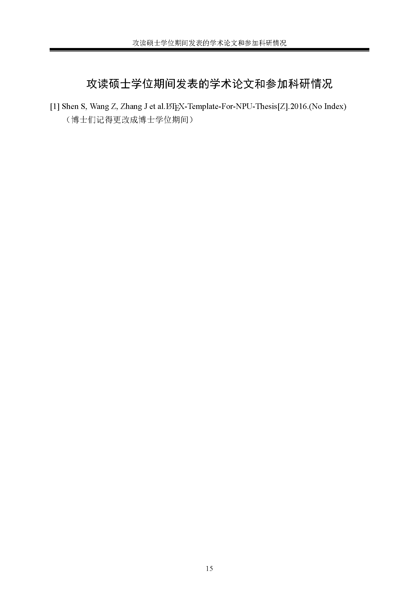

# Yet Another NPU Thesis Template


[](LICENSE)


[](https://doi.org/10.5281/zenodo.4159248)

| TeXLive Environment                                                  | Status             |
| -------------------------------------------------------------------- | ------------------ |
|  | :heavy_check_mark: |
|  | :heavy_check_mark: |
|  | :heavy_check_mark: |
|  | :heavy_check_mark: |
|  | :heavy_check_mark: |

这是在西北工业大学硕博研究生毕业设计论文格式的要求下的一份 LaTeX 文档类型模板。使用者无需修改导言区文档类型，直接在发布版的基础上，修改章节标题，撰写内容，即可完成毕业设计论文任务。

本 repo 主要基于开源库 [polossk/LaTeX-Template-For-NPU-Thesis](https://github.com/polossk/LaTeX-Template-For-NPU-Thesis) 之上修改而成，格式参照于 2014 年西北工业大学研究生院编写的[西北工业大学博士研究生学位论文编写规则（试用版）](http://gs.nwpu.edu.cn/info/1143/1139.htm)。

## 使用说明

1. 下载这个项目的 zip 包到到本地
2. 直接对 `document.tex` 文件进行修改，对应的摘要、章节内容、附录文件均已经默认生成，在此基础上加以修改即可
3. 如有必要，也可以请仿照 `document.tex` 在**导言区**引用 `\input{settings/thesis-setting}` 来直接设置文档格式
4. 如有必要，修改 `makefile` 文件的 `MAIN` 选项为自己 `tex` 文档的文件名
5. *make & Enjoy*

## 注意事项以及常见问题

* **字体问题**
  * 本模板使用的是 **Windows** 系统的自带字体（宋体，黑体，楷体，仿宋，Times New Roman，Consolas），Windows环境下目前能保证字体的指向正确。
  * 本模板目前兼容MacOSX用户。若字体出现异常，在字体册应用中查看对应字体的英文名字(与Windows下的英文名字不同)后，请在`settings/thesis-setting.tex`中替换**MacOS**环境下的字体即可。若出现故障，请发issue联系开发者团队以便修改相关配置，以帮助更多的MacOS用户。
  * 非Windows版本的用户（包括MacOSX，Linux用户）需要安装Consolas字体后正确使用，安装方法请参考此链接：[Install Consolas font on Mac](https://gist.github.com/nmcc/4e8ead6c380d8331fedd04e1aa41d351)
  * Linux用户请自行检查修改 `settings/thesis-setting.tex` 中的Linux字体配置
  * 其他用户（例如Cygwin）请发issue以获得帮助，或者删除掉`\ifwindows`和下一个`\fi`命令以使用Windows字体配置
* **`makefile` 问题**
  * 本模板提供了简单的 `makefile` 文件来控制编译流程
  * 这份 `makefile` 中的 `close`, `clean` 以及 `wipe` 选项为 `windows` 专用, 并且假设使用了 `Acrobat` 打开了当前 pdf 文件
  * 对于 Linux 玩家而言，没有比这份 `makefile` 更简单的版本了，在此基础上稍作修改即可使用
* **预创建文件**
  * 以下文件按照实际论文中出现顺序排序
  
  |       |                    展示                     |                       展示                        |
  | :---: | :-----------------------------------------: | :-----------------------------------------------: |
  | 预览  |          |        |
  | 说明  |              封面页（外封面）               |            中文标题页（题名页/内封面）            |
  | 目录  |                `frontmatter`                |                   `frontmatter`                   |
  | 文件  |               `coverpage.tex`               |                `frontpage_chs.tex`                |
  | 预览  |  |          |
  | 说明  |                 英文标题页                  |                     中文摘要                      |
  | 目录  |                `frontmatter`                |                   `frontmatter`                   |
  | 文件  |             `frontpage_eng.tex`             |                `abstract_chs.tex`                 |
  | 预览  |    |              |
  | 说明  |                  英文摘要                   |                     参考文献                      |
  | 目录  |                `frontmatter`                |                   `references`                    |
  | 文件  |             `abstract_eng.tex`              |                  `reference.bib`                  |
  | 预览  |            |  |
  | 说明  |                    附录                     |                       致谢                        |
  | 目录  |                `backmatter`                 |                   `backmatter`                    |
  | 文件  |               `appendix.tex`                |              `acknowledgements.tex`               |
  | 预览  |                |                |
  | 说明  |        发表的学术论文和参加科研情况         |                    原创性声明                     |
  | 目录  |                `backmatter`                 |                   `backmatter`                    |
  | 文件  |                `mywork.tex`                 |                  `statement.tex`                  |
* **格式符说明**
  * 字体大小（size）的控制命令统一前缀为 `s`
  * 字体格式（font）的控制命令统一前缀为 `f`
* **开源许可问题**
  * 基于 [GPLv3-LICENSE](LICENSE)
  * 如有帮助，请在自己的文章中引用；如果在此基础上新增/删除/更改，请按照开源许可的要求继续保持开源，且同时继续使用相同开源许可
* **其他可能的模板使用问题**
  * 在编译过程中，如果遇到卡在字体缓冲问题，请先关闭当前进程，并用管理员模式打开命令提示符（或终端），键入 `fc-cache -f -v` 强制刷新字体缓存即可
  * 模板成型于 **2019 年**。如果后期有任何格式上的变化，欢迎 *fork-modify-pull-request* 或者在 [issue](hhttps://github.com/NWPUMetaphysicsOffice/Yet-Another-LaTeX-Template-for-NPU-Thesis/issues) 中详细说明新旧格式之差异，我们乐意解决模板使用的问题
  * **恕制作者们不解答任何 LaTeX 使用问题**

## BibTeX

```bibtex
@software{NWPUThesisLaTeXTemplate,
    title       = {Yet Another {{\LaTeX}} Template for NPU Thesis},
    author      = {Shangkun Shen and Zhihe Wang and Jiduo Zhang and Weijia Zhang},
    month       = {11},
    year        = {2019},
    publisher   = {Zenodo},
    journal     = {GitHub repository},
    doi         = {10.5281/zenodo.4159248},
    url         = {https://doi.org/10.5281/zenodo.4159248}
}
```

## Copyright

Use this code whatever you want, under the circumstances of acknowleged the
GPL license this page below. Star this repository if you like, and it will
be very generous of you!

## License

Copyright (c) 2016-2020 *NWPU Metaphysics Office* <https://github.com/NWPUMetaphysicsOffice>

This repo is under the license of **GNU General Public License v3.0**. Go 
and check [license](LICENSE) for details.

The association *NWPU Metaphysics Office* is a club-like student group. The
members are cfrpg, kidozh, njzwj, polossk, in alphabet order.

## 彩蛋

*   分别对应着博士服与硕士服的颜色。
