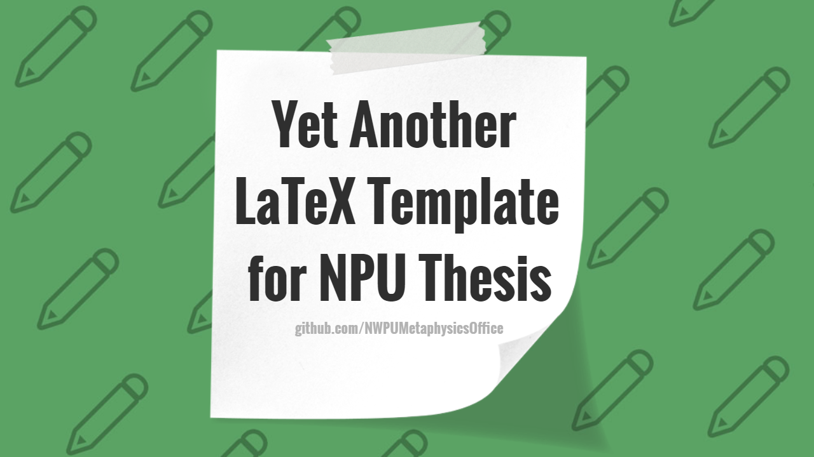
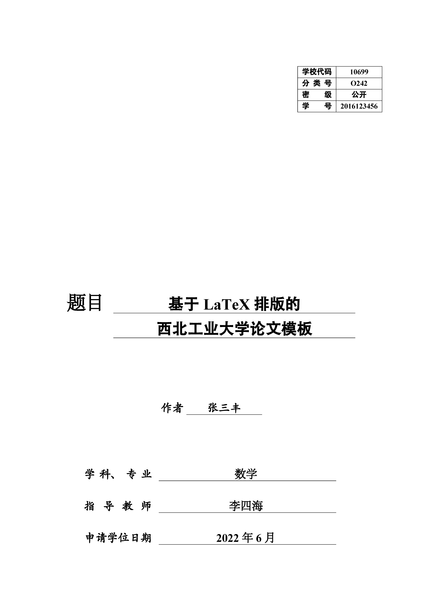
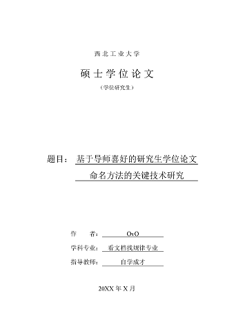
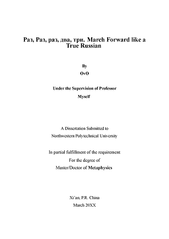
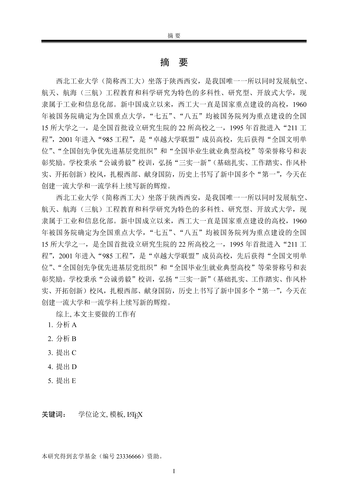
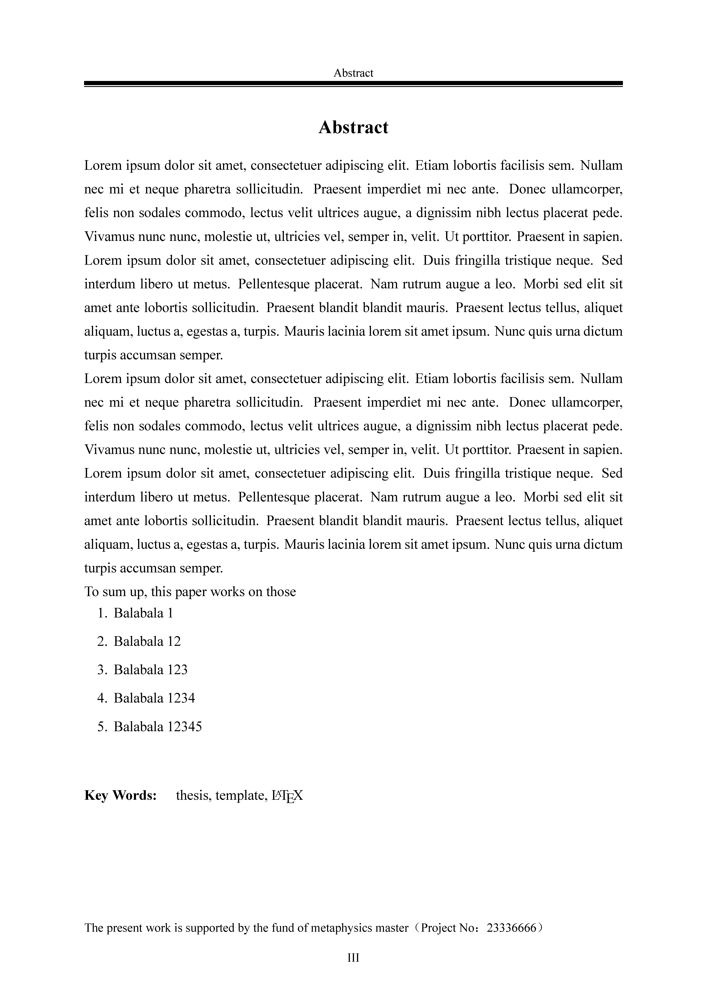
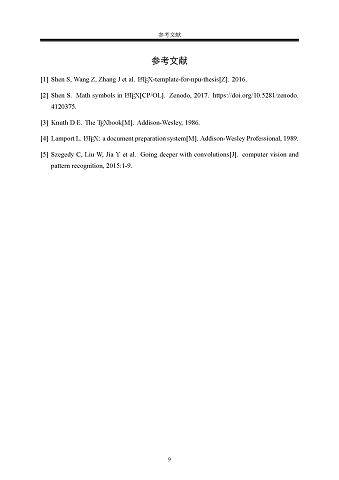
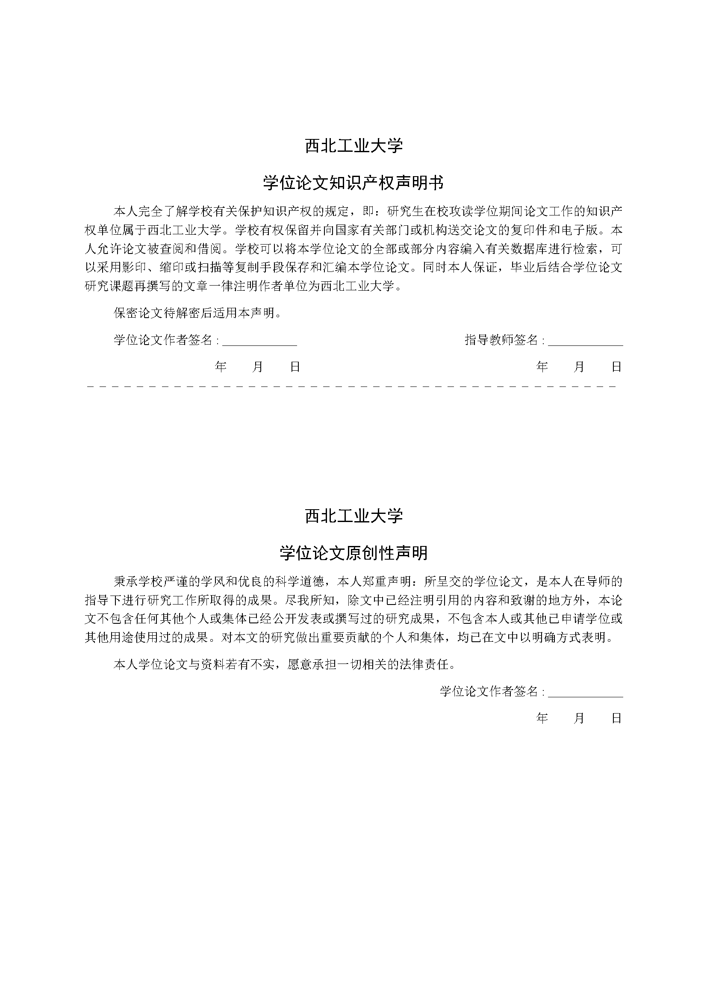

# Yet Another NPU Thesis Template




[](LICENSE)


[](https://github.com/NWPUMetaphysicsOffice/Yet-Another-LaTeX-Template-for-NPU-Thesis/zipball/master)
[](https://github.com/x-magus/Yet-Another-LaTeX-Template-for-NPU-Thesis/issues)
[](https://doi.org/10.5281/zenodo.4159248)

这是在西北工业大学硕博研究生毕业设计论文格式的要求下的一份 LaTeX 文档类型模板。使用者无需修改导言区文档类型，直接在发布版的基础上，修改章节标题，撰写内容，即可完成毕业设计论文任务。

本 repo 主要基于开源库 [polossk/LaTeX-Template-For-NPU-Thesis](https://github.com/polossk/LaTeX-Template-For-NPU-Thesis) 之上修改而成，格式参照于 2022 年西北工业大学研究生院编写的[西北工业大学研究生学位论文写作指南](https://gs.nwpu.edu.cn/info/2284/15346.htm)。

## 使用说明

1. 下载这个项目的 zip 包到到本地
2. 直接对 `yanputhesis-sample.tex` 文件进行修改，对应的摘要、章节内容、附录文件均已经默认生成，在此基础上加以修改即可
3. 如有必要，也可以请仿照 `yanputhesis-sample.tex` 在**导言区**引用 `\documentclass[lang=chs, degree=phd, blindreview=false, adobe=true]{yanputhesis}` 来直接设置文档格式
4. 如有必要，修改 `makefile` 文件的 `MAIN` 选项为自己 `tex` 文档的文件名
5. *make samplebib & Enjoy*

## 基本信息录入

```tex
%%=============================================================================%
%% 基本信息录入
%%-----------------------------------------------------------------------------%
\title{基于 LaTeX 排版的 \\ 西北工业大学论文模板}{          % 中英文标题
    Yet Another Thesis Template of \\ Northwestern Polytechnical University
}                                                           % 请自行断行
\author{张三丰}{Sanfeng Zhang}                              % 姓名
\date{2022年6月}{Jun 2022}                                  % 答辩日期
\school{数学与统计学院}{School of Mathematics and Statistics}% 学院
% 专业 博士请使用 Philosophy in XXXX，硕士只写 XXXX 即可
\major{数学}{Philosophy in Mathematics}                     % 专业
\advisor{李四海{\enspace}教授}{Sihai Li}                    % 导师
\studentnumber{2016123456}                                  % 学号
\funding{本研究得到玄学基金（编号23336666）资助．}{         % 基金资助
    The present work is supported by Funding of Metaphysics %
    (Project No：23336666).}                                %
%%=============================================================================%
```

## 注意事项以及常见问题

* **博士学位论文 or 硕士学位论文？**
  * 本模版默认为博士学位论文，并且兼容硕士学位论文，但是不兼容本科毕业设计论文（未来计划兼容）。
  * 硕士如需使用，请使用编辑器搜索 `degree=phd` 标志，并修改 `phd` 文本为 `master` 即可。
  * 本科毕业设计论文请直接使用 [polossk/LaTeX-Template-For-NPU-Thesis](https://github.com/polossk/LaTeX-Template-For-NPU-Thesis) 模板，使用方式和本模板类似，不再赘述。
* **参考文献格式问题**
  * 默认使用 `nputhesis.bst` [国标 GB/T 7714—2015 格式文件](https://github.com/zepinglee/gbt7714-bibtex-style)，请在 tex 文档中声明 `\bibliographystyle{nputhesis}`。
  * **如果有专家评审问询到参考文献格式中为何会有多余的斜线（斜杠）**，请立即更换使用订正后的 `nputhesis-noslash.bst` 格式文件，如果有其他问题，请提交 issue，注明所引用的参考文献的类型以及对应的 `bibtex` 代码，最好展示出目前的输出结果与目标期望输出结果，方便我们帮助维护改正。
* **字体问题**
  * 本模板使用的是 **Windows** 系统的自带字体（宋体、黑体、楷体、仿宋、Times New Roman、Consolas），Windows 环境下目前能保证字体的指向正确。
  * 本模板目前兼容 macOS 用户。请在编译的时候添加 `-shell-escape` 选项，以保证模板正确识别操作系统。若字体出现异常，在字体册应用中查看对应字体的英文名字（与 Windows 下的英文名字不同）后，请在 `settings/thesis-setting.tex` 中替换 **macOS** 环境下的字体即可。若出现故障，请发 issue 联系开发者团队以便修改相关配置，以帮助更多的 macOS 用户。
  * 关于 macOS 用户的**黑体**解决方案
    * 非 Windows 操作系统的用户并没有取得 Windows 上黑体字体 `SimHei` 字体的授权，然而文章送审时你的评委老师的电脑极有可能是 Windows 的，所以请务必注意。目前在 macOS 上，其他黑体的表现（比如 macOS 自带的华文黑体系列）很奇怪（字体很挤、字重不统一等）。如果是面向送审，推荐从 Windows 上拷贝一整套字体（宋黑楷仿宋）然后将 `\ifmacosx` 后面的字体配置与 Windows 一致即可。
    * 如果你觉得 Windows 上的字体也很丑不够美观，可以自行更换为其他开源或商用字体。比如开源的[思源宋体](https://github.com/adobe-fonts/source-han-serif)、[思源黑体](https://github.com/adobe-fonts/source-han-serif)，然后更新对应操作系统的字体配置。
    * 请注意，如果你的文章会被收录或者其他商业用途，建议使用开源字体或默认操作系统字体，以免不必要的麻烦。
  * 关于缺失等宽字体（默认 Consolas）的解决方案
    * 非 Windows 操作系统的用户（包括 macOS 与 Linux 用户）需要安装 Consolas 字体后使用，字体文件存放于 `fonts/` 文件夹中。
    * 如果有其他字体的需求，也可以自行更改 `settings/thesis-setting.tex` 中对应操作系统下的 `\newcommand\codeFont{Consolas}` 为其他字体，例如修改为 `\newcommand\codeFont{Source Code Pro}` 以使用 `Source Code Pro` 字体。
  * Linux用户请自行检查修改 `settings/thesis-setting.tex` 中的Linux字体配置
  * 其他用户（例如 Cygwin ）请发 issue 以获得帮助，或者注释掉 `\ifwindows` 之后的关于跨平台的字体控制代码，直接修改上方已经被注释掉的 `MAYDAY!` 字体配置。
* **`makefile` 问题**
  * 本模板提供了简单的 `makefile` 文件来控制编译流程，可以编译 `dtx` 文件从而得到模板类 `cls` 文件，也可以编译大论文文档 `yanputhesis-sample.tex`。
  * 所有基本流程为关闭当前已打开的输出 pdf 文件并删除，清理缓存文件，编译 tex 文档并打开。
  * 默认选项 `make` 或者 `make main` 负责编译编译 `dtx` 文件从而得到模板类 `yanputhesis.cls` 文件和样例文件 `yanputhesis-sample.tex`。
  * 提供选项 `make sample` 负责生成不含参考文献的样例文档 `yanputhesis-sample.pdf`
  * 提供选项 `make samplebib` 负责生成含有参考文献的样例文档 `yanputhesis-sample.pdf`
  * 同时提供了 `open[sample]`, `close`, `clean`, `wipe[sample]` 四组快捷指令，其效果如下：
    * `open[sample]`：使用 Acrobat 打开输出的 pdf 文件；
    * `close`：终止 Acrobat 进程从而关闭输出的 pdf 文件（会误伤其他以打开的文件）；
    * `clean`：删除 `*.aux` 和其他缓存文件；
    * `wipe[sample]`：删除输出的 pdf 文件；
  * 对于 Linux 玩家而言，可参考上述功能，并在此 `makefile` 基础上稍作修改即可使用。
* **成品预览**
  * 以下命令或环境按照实际论文中出现顺序排序
  * 封皮页及标题页 `\maketitle`
  * 中文摘要及关键字 `\begin{abstract} ... \begin{keywords} ... \end{keywords} \end{abstract}`
  * 英文摘要及关键字 `\begin{engabstract} ... \begin{engkeywords} ... \end{engkeywords} \end{engabstract}`
  * 参考文献 `\bibliography{reference}`
  * 附录 `\appendix \section{附录} ...`
  * 致谢 `\begin{acknowledgements} ... \end{acknowledgements}`
  * 发表的学术论文和参加科研情况 `\begin{accomplishments} ... \end{accomplishments}`
  * 原创性声明 `\makestatement`

  |       |                      展示                       |                       展示                        |
  | :---: | :---------------------------------------------: | :-----------------------------------------------: |
  | 预览  |              |        |
  | 说明  |                封面页（外封面）                 |            中文标题页（题名页/内封面）            |
  | 预览  |      |          |
  | 说明  |                   英文标题页                    |                     中文摘要                      |
  | 预览  |        |              |
  | 说明  |                    英文摘要                     |                     参考文献                      |
  | 预览  |                |  |
  | 说明  |                      附录                       |                       致谢                        |
  | 预览  |  |                |
  | 说明  |          发表的学术论文和参加科研情况           |                    原创性声明                     |

* **格式符说明**
  * 字体大小（size）的控制命令统一前缀为 `s`
  * 字体格式（font）的控制命令统一前缀为 `f`
* **开源许可问题**
  * 基于 [GPLv3-LICENSE](LICENSE)
  * 如有帮助，请在自己的文章中引用；如果在此基础上新增/删除/更改，请按照开源许可的要求继续保持开源，且同时继续使用相同开源许可
* **其他可能的模板使用问题**
  * 在编译过程中，如果遇到卡在字体缓冲问题，请先关闭当前进程，并用管理员模式打开命令提示符（或终端），键入 `fc-cache -f -v` 强制刷新字体缓存即可
  * 模板成型于 **2022 年**。如果后期有任何格式上的变化，欢迎 *fork-modify-pull-request* 或者在 [issue](hhttps://github.com/NWPUMetaphysicsOffice/Yet-Another-LaTeX-Template-for-NPU-Thesis/issues) 中详细说明新旧格式之差异，我们乐意解决模板使用的问题
  * **恕制作者们不解答任何 LaTeX 使用问题**

## BibTeX

```bibtex
@software{NWPUThesisLaTeXTemplate,
    title       = {Yet Another {{\LaTeX}} Template for NPU Thesis},
    author      = {Shangkun Shen and Zhihe Wang and Jiduo Zhang and Weijia Zhang},
    month       = {11},
    year        = {2019},
    publisher   = {Zenodo},
    journal     = {GitHub repository},
    doi         = {10.5281/zenodo.4159248},
    url         = {https://doi.org/10.5281/zenodo.4159248}
}
```

## Copyright

Use this code whatever you want, under the circumstances of acknowleged the
GPL license this page below. Star this repository if you like, and it will
be very generous of you!

## License

Copyright (c) 2016-2022 *NWPU Metaphysics Office* <https://github.com/NWPUMetaphysicsOffice>

This repo is under the license of **GNU General Public License v3.0**. Check [license](LICENSE) for details.

The association *NWPU Metaphysics Office* is a club-like student group. The
members are cfrpg, kidozh, njzwj, polossk, in alphabet order.

## 彩蛋

*   分别对应着博士服与硕士服的颜色。
